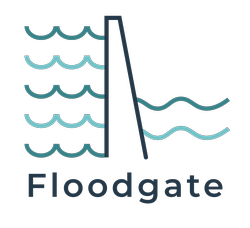

# Floodgate

[](https://app.circleci.com/pipelines/github/codilime/floodgate)

## Motivation

This project integrates multiple parts of "as-code" experience in Spinnaker, eg. API, Sponnet, Pipeline Templates for a complete GitOps workflow. 

## Features

- [x] Allows creating configuration of applications, pipeline templates and pipelines as file types:
  - [x] JSONNET
  - [x] JSON
  - [x] YAML
- [x] Updates only the parts of Spinnaker configuration that have actually changed
- [x] Reports diffs in managed objects 
- [ ] Works with all currently supported versions of Spinnaker
- [ ] Is well suited to run in a CI system (single binary!)

## Upcoming features

- [ ] Run as a microservice within Spinnaker installation for seamless integration

## Build process

This repository contains a "known-working" version of `gate-swagger.json` file, which is a definition of Gate's API, used to generate client code in go using `swagger-codegen`.

CircleCI process uses the `swagger-codegen-cli` JAR file to generate the API client at build time.

As a developer, you can use `generate_swaggerapi.sh` script, which will use Docker to generate go client code for Gate API in the `gateapi` directory. For example:

```
./generate_swaggerapi.sh gate-swagger.json
* Using swagger-codegen-cli 2.4.12
2.4.12: Pulling from swaggerapi/swagger-codegen-cli
e7c96db7181b: Already exists
f910a506b6cb: Already exists
b6abafe80f63: Already exists
36ebbdce0651: Pull complete
Digest: sha256:fc24e10784390e27fae893a57da7353d695e641920f3eb58f706ee54af92ebed
Status: Downloaded newer image for swaggerapi/swagger-codegen-cli:2.4.12
docker.io/swaggerapi/swagger-codegen-cli:2.4.12
* Cleaning up gateapi directory
* Generating new gateapi code using gate-swagger.json file...
[main] INFO io.swagger.parser.Swagger20Parser - reading from /local/gate-swagger.json
[...]
```

**Note:** This will remove current contents of `gateapi` directory!

You can also obtain the same using raw java file, like in CI:

```
$ SWAGGER_VERSION=$(cat gateapi/.swagger-codegen/VERSION)
$ wget https://repo1.maven.org/maven2/io/swagger/swagger-codegen-cli/${SWAGGER_VERSION}/swagger-codegen-cli-${SWAGGER_VERSION}.jar -O /tmp/swagger-codegen-cli.jar
$ rm -r gateapi
$ java -jar /tmp/swagger-codegen-cli.jar generate -l go -i gate-swagger.json -o gateapi
```

**Note:** This will remove current contents of `gateapi` directory!

## How to run?

This project uses the Go module system.
First, make sure you have some version of Spinnaker running.

Get the repository using `go get`:
```bash
go get github.com/codilime/floodgate
```
This will download, compile and install Floodgate to `$GOPATH/bin`. If this directory is present in your `$PATH`, the `floodgate` command will be available from any directory.

Create a `config.yaml` file. An example one can be found in `examples/config.yaml`.
Floodgate checks if a config file is present in:
```bash
$HOME/.config/floodgate/config.yaml
```
You can also specify a path to the config file using the `--config` flag.

Additionally, you can find example resources in the `examples/resources` directory.

**Note:** To allow Floodgate to control pipeline templates apply those commands to your environment:
```bash
hal config features edit --pipeline-templates true
hal deploy apply
```

**Note:** To view pipeline templates in the UI use:
```bash
hal config features edit --managed-pipeline-templates-v2-ui true
hal deploy apply
```

To run tests, navigate to the root of the repository and run this command:
```bash
go test ./...
```

## How to use?

`floodgate` has a simple to use CLI:
```bash
$ floodgate
Usage:
   [command]

Available Commands:
  compare     Compare local resources' definitions with Spinnaker and show discrepancies
  help        Help about any command
  hydrate     Hydrate pipeline templates with configurations and preview the result
  inspect     Inspect resources' status on Spinnaker
  render      Render Jsonnet files
  synchronize Synchronize resources to Spinnaker

Flags:
      --config string   path to config file (default $HOME/.config/floodgate/config.yaml)
  -h, --help            help for this command
  -q, --quiet           hide non-essential output
  -v, --verbose         show extended output
      --version         version for this command

Use " [command] --help" for more information about a command.
```

JSON comparison is achieved using an external library. For full output specification please check https://github.com/josephburnett/jd#diff-language

Simple example:

a.json:
`{"hungry":"true", "pizza":{"eat":"true","like":"true"},"pasta":{"eat":"true","like":"false"}}`

b.json:
`{"hungry":"false", "pizza":{"eat":"true","like":"true"},"pasta":{"eat":"false","like":"true"}}`

Difference between a.json and b.json:
```
@ ["hungry"]
- "true"
+ "false"
@ ["pasta","eat"]
- "true"
+ "false"
@ ["pasta","like"]
- "false"
+ "true"
```

## Using JSONNET

Files that have a `.jsonnet` file extention will be evaluated as JSONNET files. Output of each file should be either a single object or an array of objects.

## License

Floodgate is licensed under Apache 2.0 License, following other Spinnaker's components.

